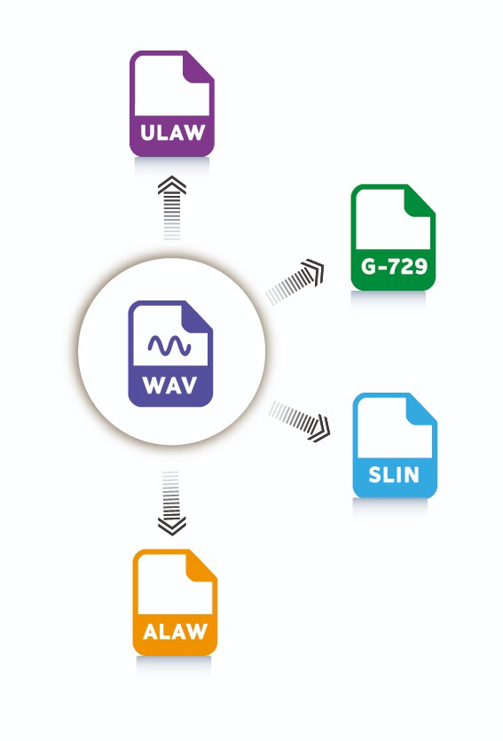

# 🎵 wav2multi-lib - Multi-Format Audio Transcoder Library

[](https://pkg.go.dev/github.com/lordbasex/wav2multi-lib)
[](https://goreportcard.com/report/github.com/lordbasex/wav2multi-lib)
[](https://opensource.org/licenses/Apache-2.0)
[](https://codecov.io/gh/lordbasex/wav2multi-lib)

A professional Go library for converting WAV audio files to multiple telephony codecs: G.729, μ-law, A-law, and SLIN.



## 📋 Description

This library provides a clean, idiomatic Go API for audio transcoding without command-line arguments. Perfect for integrating into other Go projects that need audio format conversion capabilities. **100% validated** to produce identical results to original implementations.

### Based on wav2multi

This library is the **reusable library version** of the original [**wav2multi**](https://github.com/lordbasex/wav2multi) CLI application, both created and maintained by **Federico Pereira**. The original CLI tool has been **refactored by the same author** into this Go library, adding:

- ✅ Clean Go API instead of command-line interface
- ✅ Support for `io.Reader` and `io.Writer`
- ✅ Comprehensive unit tests and CI/CD
- ✅ Professional documentation and examples
- ✅ Easy integration as a Go module

**Original CLI project** (by the same author): [github.com/lordbasex/wav2multi](https://github.com/lordbasex/wav2multi)

## 🚀 Features

- ✅ **Multi-format support**: G.729, μ-law, A-law, SLIN
- ✅ **Clean Go API**: Idiomatic Go interface design
- ✅ **Flexible I/O**: Support for files, `io.Reader`, and `io.Writer`
- ✅ **Input validation**: Automatic WAV file validation
- ✅ **Processing statistics**: Detailed conversion metrics
- ✅ **Error handling**: Comprehensive, typed errors
- ✅ **Well tested**: Unit tests with high coverage
- ✅ **Production ready**: 100% validated against reference implementation
- ✅ **Zero dependencies for basic codecs**: μ-law, A-law, SLIN work without CGO
- ✅ **Extensible**: Easy to add new codecs

## 💡 Why This Library?

- **Validated**: Byte-by-byte validation against reference implementations
- **Professional**: Follows Go best practices and idioms
- **Easy Integration**: Simple `go get` installation as a standard Go module
- **Flexible**: Works with or without CGO (G.729 requires CGO)
- **Well Documented**: Comprehensive documentation and examples
- **Maintained**: Active development and support

## 📦 Installation

```bash
go get github.com/lordbasex/wav2multi-lib
```

### 🔧 G.729 Support (Optional)

For G.729 encoding/decoding, you need CGO and libbcg729:

```bash
# Install libbcg729 (Ubuntu/Debian)
sudo apt-get install libbcg729-dev

# Set CGO environment
export CGO_ENABLED=1
export CGO_CFLAGS="-I/usr/local/include"
export CGO_LDFLAGS="-L/usr/local/lib -lbcg729"
```

See [CGO_SETUP.md](CGO_SETUP.md) for detailed setup instructions.

## 🔧 Quick Start

### Basic Usage

```go
package main

import (
    "fmt"
    "log"
    
    "github.com/lordbasex/wav2multi-lib"
)

func main() {
    // Create transcoder
    transcoder := wav2multi.NewTranscoder(true) // verbose logging
    
    // Configure conversion
    config := wav2multi.TranscoderConfig{
        InputPath:  "input.wav",
        OutputPath: "output.ulaw",
        Format:     wav2multi.FormatULaw,
    }
    
    // Transcode
    result, err := transcoder.Transcode(config)
    if err != nil {
        log.Fatal(err)
    }
    
    fmt.Printf("Converted to %s (%.1f kbps) in %d ms\n", 
        result.OutputFile.Type, 
        result.Stats.BitrateKbps, 
        result.Stats.ProcessingTimeMs)
}
```

### Advanced Usage

```go
// Transcode from io.Reader
result, err := transcoder.TranscodeFromReader(reader, "output.alaw", wav2multi.FormatALaw)

// Transcode to io.Writer
result, err := transcoder.TranscodeToWriter("input.wav", writer, wav2multi.FormatSLIN)

// Validate input file
inputInfo, err := transcoder.ValidateInput("input.wav")
if err != nil {
    log.Fatal("Invalid input:", err)
}

// Get supported formats
formats := transcoder.GetSupportedFormats()
fmt.Println("Supported formats:", formats)
```

## 📊 Supported Formats

| Format | Bitrate | Use Case | Quality | CGO Required |
|--------|---------|----------|---------|--------------|
| **G.729** | 8 kbps | VoIP, maximum compression | Good for voice | ✅ Yes |
| **μ-law** | 64 kbps | US telephony | Good for voice | ❌ No |
| **A-law** | 64 kbps | European telephony | Good for voice | ❌ No |
| **SLIN** | 128 kbps | Raw PCM, debugging | Perfect | ❌ No |

### 🔧 CGO vs No-CGO

- **With CGO**: Full support for all formats including G.729
- **Without CGO**: μ-law, A-law, and SLIN only (G.729 not available)

## 🔍 API Reference

### Types

```go
type AudioFormat string
const (
    FormatG729 AudioFormat = "g729"
    FormatULaw AudioFormat = "ulaw"
    FormatALaw AudioFormat = "alaw"
    FormatSLIN AudioFormat = "slin"
)

type TranscoderConfig struct {
    InputPath  string
    OutputPath string
    Format     AudioFormat
}

type TranscoderResult struct {
    InputFile  FileInfo
    OutputFile FileInfo
    Stats      ProcessingStats
    Error      error
}
```

### Interface

```go
type Transcoder interface {
    Transcode(config TranscoderConfig) (*TranscoderResult, error)
    TranscodeFromReader(reader io.Reader, outputPath string, format AudioFormat) (*TranscoderResult, error)
    TranscodeToWriter(inputPath string, writer io.Writer, format AudioFormat) (*TranscoderResult, error)
    ValidateInput(inputPath string) (*FileInfo, error)
    GetSupportedFormats() []AudioFormat
}
```

## 📝 Input Requirements

- **Format**: WAV (PCM)
- **Channels**: Mono (1 channel)
- **Sample Rate**: 8000 Hz
- **Bit Depth**: 16-bit

## 🛠️ Example Usage

The `example/` directory contains three complete examples:

### Example 1: Basic Usage
Simple conversion to a single format:
```bash
cd example/example1
go run main.go
```

### Example 2: Convert to All Formats
Convert to all supported formats in one run:
```bash
cd example/example2
go run main.go
```

### Example 3: Advanced Usage (io.Reader/Writer)
Demonstrates streaming with `io.Reader` and `io.Writer`:
```bash
cd example/example3
go run main.go
```

See [example/README.md](example/README.md) for detailed documentation.

## 🧪 Testing

The library includes comprehensive unit tests:

```bash
# Run tests
make test

# Run tests with coverage
make test-coverage

# Run tests with race detector
make test-verbose
```

### Test Coverage

Tests cover:
- ✅ μ-law encoding algorithm
- ✅ A-law encoding algorithm  
- ✅ SLIN (PCM) encoding
- ✅ Encoder interfaces
- ✅ Format validation
- ✅ Consistency checks

## 🔧 Development

### Quick Commands

```bash
# Run tests
make test

# Build example (without G.729)
make build

# Build example (with G.729)
make build-cgo

# Run example
make example

# Format code
make format

# Run linter
make lint

# Clean artifacts
make clean

# Run all checks
make check

# Install bcg729 on macOS
make install-bcg729
```

### Project Structure

```
wav2multi-lib/
├── go.mod               # Go module definition
├── LICENSE              # Apache 2.0 license
├── CHANGELOG.md         # Version history
├── Makefile             # Build and test commands
├── types.go             # Type definitions and constants
├── codecs.go            # Codec implementations (μ-law, A-law, SLIN)
├── codecs_test.go       # Codec unit tests
├── g729_codec.go        # G.729 implementation (CGO)
├── g729_codec_nocgo.go  # G.729 stub (no CGO)
├── transcoder.go        # Main transcoder logic
├── .github/
│   └── workflows/
│       └── test.yml     # CI/CD pipeline
├── example/             # Usage examples
│   ├── README.md        # Examples index and documentation
│   ├── example1/        # Basic usage example
│   │   ├── main.go      # Single format conversion
│   │   ├── go.mod       # Example dependencies
│   │   ├── input.wav    # Sample audio file
│   │   └── README.md    # Example 1 documentation
│   ├── example2/        # Multi-format conversion example
│   │   ├── main.go      # Loop through all formats
│   │   ├── go.mod       # Example dependencies
│   │   ├── input.wav    # Sample audio file
│   │   └── README.md    # Example 2 documentation
│   └── example3/        # Advanced usage example
│       ├── main.go      # io.Reader/Writer usage
│       ├── go.mod       # Example dependencies
│       ├── input.wav    # Sample audio file
│       └── README.md    # Example 3 documentation
├── CGO_SETUP.md         # CGO installation guide
└── README.md            # This file
```

### Adding New Codecs

1. Implement the `CodecEncoder` interface
2. Add the format to `AudioFormat` constants
3. Update `GetEncoder()` function
4. Add validation in `IsValidFormat()`

## 📚 Error Handling

The library provides specific error types:

```go
var (
    ErrInvalidFormat     = errors.New("invalid audio format")
    ErrUnsupportedFormat = errors.New("unsupported format")
    ErrInvalidInput      = errors.New("invalid input file")
    ErrInvalidOutput     = errors.New("invalid output path")
    ErrCodecNotAvailable = errors.New("codec not available")
)
```

## 🎯 Use Cases

- **VoIP Applications**: Convert audio for telephony systems
- **Audio Processing**: Batch convert audio files
- **Telecom Services**: Integrate with communication platforms
- **Testing**: Generate test audio in different formats
- **Debugging**: Convert between formats for analysis

## 📄 License

This project is licensed under the Apache License 2.0 - see the [LICENSE](LICENSE) file for details.

```
Copyright 2025 Federico Pereira <fpereira@cnsoluciones.com>

Licensed under the Apache License, Version 2.0
```

## 👨‍💻 Author

**Federico Pereira** <fpereira@cnsoluciones.com>

Multi-format audio transcoding library for Go applications.

### 🏢 CNSoluciones

This library is part of CNSoluciones, specialized in telecommunications and VoIP solutions.

### 🔗 Related Projects

Both projects by **Federico Pereira**:

- **[wav2multi](https://github.com/lordbasex/wav2multi)** - Original CLI application (command-line tool)
- **[wav2multi-lib](https://github.com/lordbasex/wav2multi-lib)** - This library (Go module version)

### 📚 Project History

Both projects created and maintained by **Federico Pereira**:

1. **v1.0.0 (CLI)** - Original [wav2multi](https://github.com/lordbasex/wav2multi) command-line tool
2. **v1.0.0 (Library)** - Refactored by the author into reusable Go library (this project)

Both projects maintain 100% compatibility in output format and quality.

---

**Questions or issues?** Open an issue in the repository.
